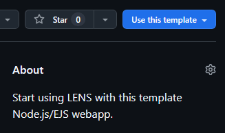

# LENS App

This is a template HTML/CSS/JS website that demonstrates how to use LENS for authentication.

## Prerequisites

- A web browser

## Installation

1. Clone the repository:

    ```sh
    git clone https://github.com/LENSAuth/my-site.git
    cd my-site
    ```

   - 1a. Use as template:

       To instead use this repository as a template for new projects, click the "Use this template" button on [the GitHub repository](https://github.com/LENSAuth/my-site), or click this link: [Create a new repository](https://github.com/new?template_name=my-site&template_owner=LENSAuth).

       

## Running the App

1. Open `index.html` in your web browser.

## Project Structure

- `index.html`: Main HTML file that sets up the structure of the web page.
- `assets/script.js`: JavaScript file that handles the LENS authentication and popup window.
- `assets/style.css`: CSS file for styling the web page.
- `.gitignore`: Specifies files and directories to be ignored by Git.

## Usage

### Popup Window

- The `index.html` file includes a script that opens a popup window to `https://lens.admin-host.com` and listens for messages from this origin.
- When a message is received from the popup, it is logged to the console and displayed on the page.

## Notes

- Ensure that the domain you are using is registered with LENS. For testing purposes, you can register `localhost`.
- The browser logs the status and received data to the console.

## License

This project is licensed under the MIT License.